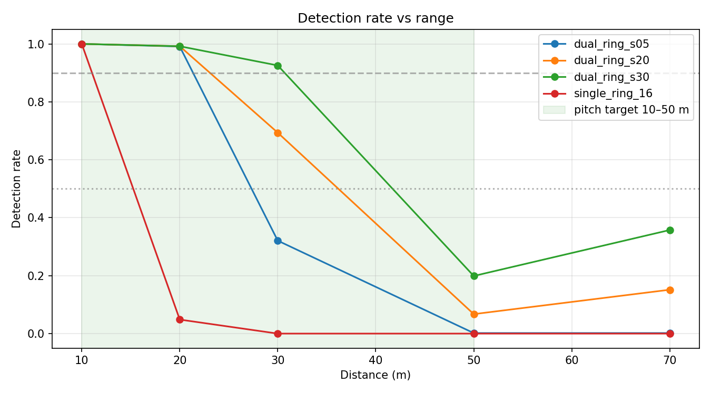
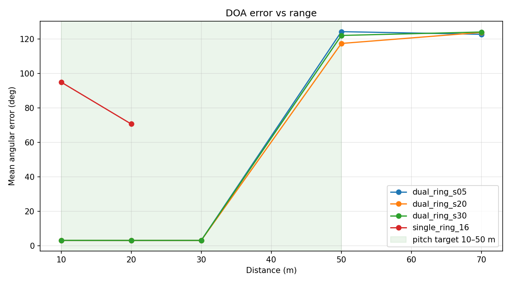
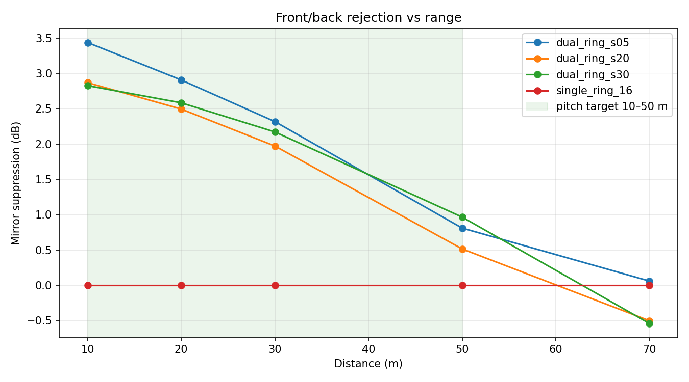

# Geometry Comparison Report

Generated: 2026-07-04T20:53:41
Distances: 10, 20, 30, 50, 70 m · 3 seed(s) per point · full mode (full-sphere search)

SNR at each distance follows from the EIN budget (drone SPL − spreading − absorption − mic noise floor); the drone is stationary at the configured bearing.

| Geometry | Mics | Range@90% | Range@50% | Err@30 m | Mirror supp. | MCU (H753) |
|---|---|---|---|---|---|---|
| dual_ring_s05 | 16 | 21.4 m | 27.3 m | 3.1° | 1.9 dB | 77.67 MB / 22.0 ms per 10.7 ms frame [MEMORY] |
| dual_ring_s20 | 16 | 23.1 m | 36.2 m | 3.1° | 1.5 dB | 77.67 MB / 22.0 ms per 10.7 ms frame [MEMORY] |
| dual_ring_s30 | 16 | 30.7 m | 41.7 m | 3.1° | 1.6 dB | 77.67 MB / 22.0 ms per 10.7 ms frame [MEMORY] |
| single_ring_16 | 16 | 11.1 m | 15.3 m | — | -0.0 dB | 77.67 MB / 22.0 ms per 10.7 ms frame [MEMORY] |

Range@X% = interpolated distance where detection rate crosses X%; '—' means the curve never crossed inside the tested distances. MCU column: phase-table memory and est. frame compute vs the frame period for the *station's own* search grid (not the research full-sphere grid used for the curves above).

