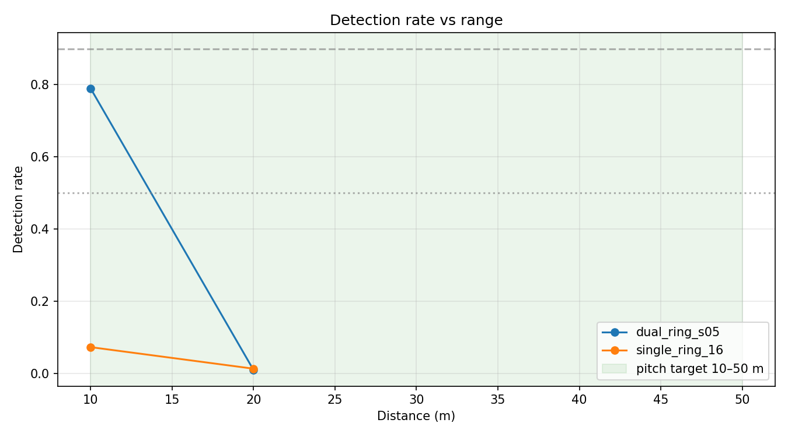
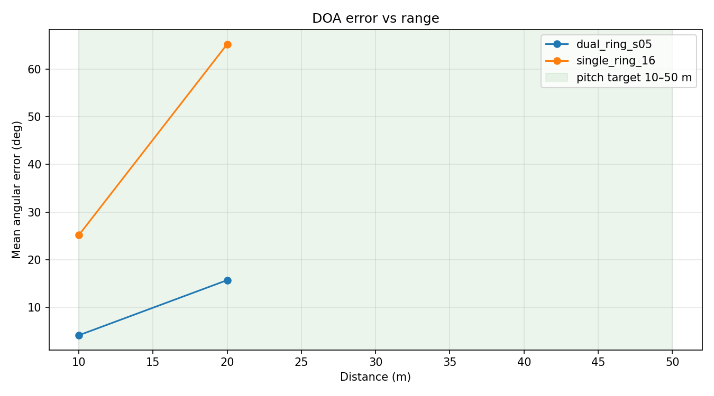
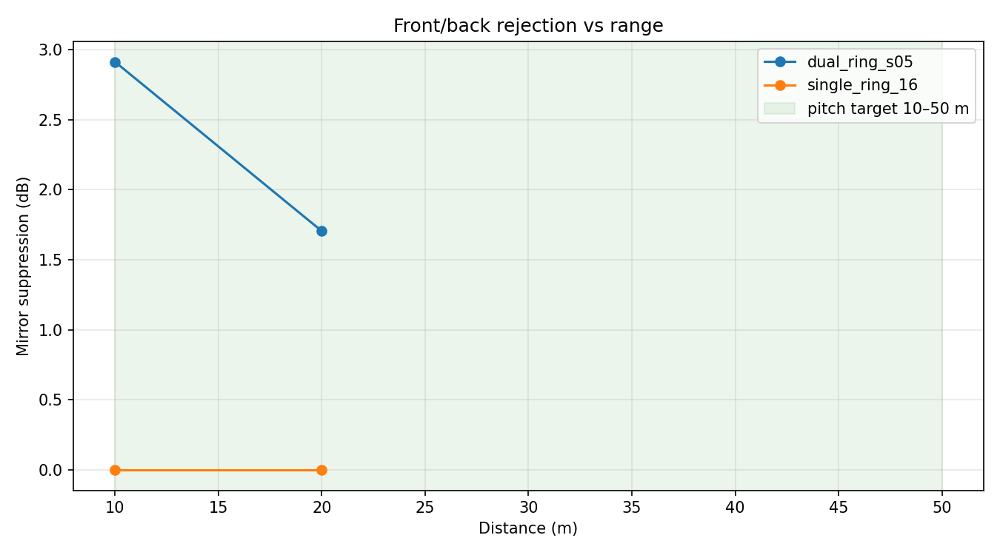
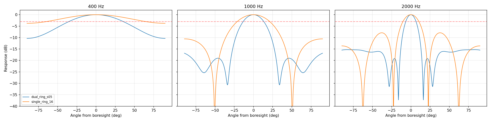
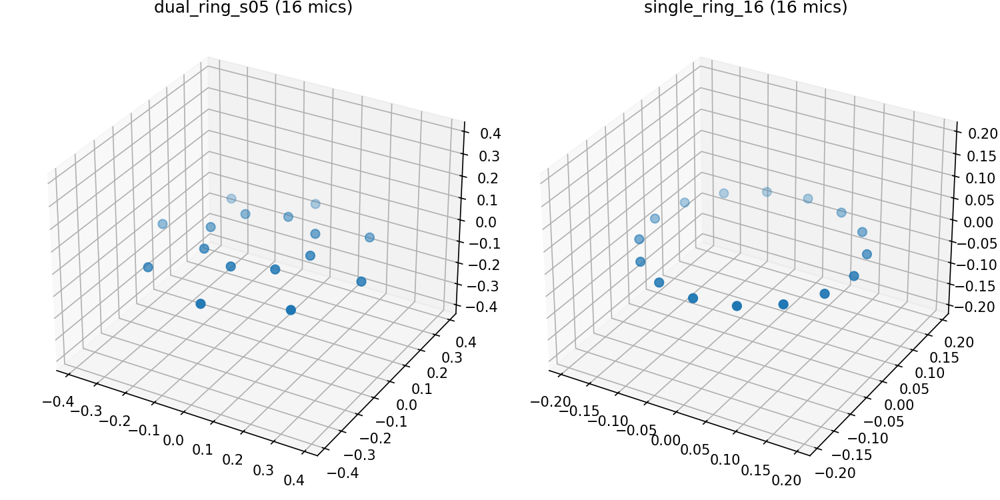

# Geometry Comparison Report

Generated: 2026-07-10T03:23:48
Distances: 10, 20 m · 3 seed(s) per point · quick mode (full-sphere search)

SNR at each distance follows from the EIN budget (drone SPL − spreading − absorption − mic noise floor); the drone is stationary at the configured bearing.

| Geometry | Mics | Range@90% | Range@50% | Err@30 m | Mirror supp. | MCU (first target) |
|---|---|---|---|---|---|---|
| dual_ring_s05 | 16 | — | 13.7 m | 15.7° | 2.3 dB | stm32h753 fails: SRAM 78.00 MB > 928 KB |
| single_ring_16 | 16 | — | — | 65.3° | 0.0 dB | stm32h753 fails: SRAM 78.00 MB > 928 KB |

Range@X% = interpolated distance where detection rate crosses X%; '—' means the curve never crossed inside the tested distances. MCU column: the first configured target's verdict (cycle model, memory placement, TDM ingest) for the *station's own* search grid (not the research full-sphere grid used for the curves above).

## MCU feasibility

Per-stage requirements (SRP-PHAT + log-mel cost model + uplink) for the station's own search grid, matched against each target profile. A verdict fails if compute, SRAM, flash, **or** mic TDM ingest (SAI/I2S buses × slots × bit clock) does not fit — an MCU that cannot physically connect the mics is never recommended. See docs/mcu.md for formulas and profile provenance.

### dual_ring_s05 (16 mics)

Required: 5049 MHz (reference M7 core, unbounded memory bandwidth, 30% headroom; per-target verdicts use each profile's own core and memory model) · 78.00 MB RAM · 17 KB flash · 57.6 kbps uplink

| Stage | RAM | Flash | MCycles/s (ref. core) |
|---|---|---|---|
| srp_phat | 77.999 MB | 8.0 KB | 3883.4 |
| log_mel | 0.000 MB | 8.5 KB | 0.5 |
| transmit | 0.000 MB | 0.0 KB | 0.0 |

| Target | Verdict |
|---|---|
| stm32h753 | fails: compute 5050 MHz > 480 MHz; SRAM 78.00 MB > 928 KB; flash OK (17 KB ≤ 2.00 MB); audio OK (2 buses ≤ 8 (8 mics/bus)) |

**Recommended:** none of the configured targets

### single_ring_16 (16 mics)

Required: 5049 MHz (reference M7 core, unbounded memory bandwidth, 30% headroom; per-target verdicts use each profile's own core and memory model) · 78.00 MB RAM · 17 KB flash · 57.6 kbps uplink

| Stage | RAM | Flash | MCycles/s (ref. core) |
|---|---|---|---|
| srp_phat | 77.999 MB | 8.0 KB | 3883.4 |
| log_mel | 0.000 MB | 8.5 KB | 0.5 |
| transmit | 0.000 MB | 0.0 KB | 0.0 |

| Target | Verdict |
|---|---|
| stm32h753 | fails: compute 5050 MHz > 480 MHz; SRAM 78.00 MB > 928 KB; flash OK (17 KB ≤ 2.00 MB); audio OK (2 buses ≤ 8 (8 mics/bus)) |

**Recommended:** none of the configured targets

